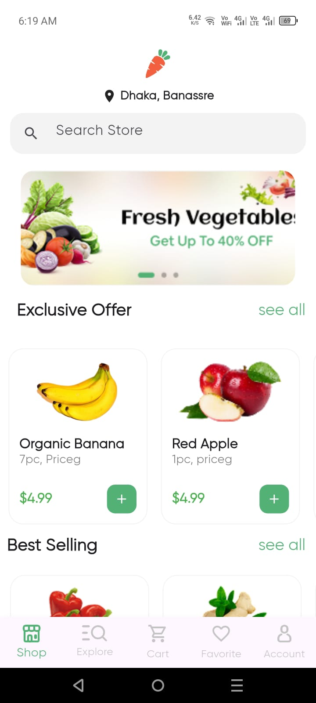
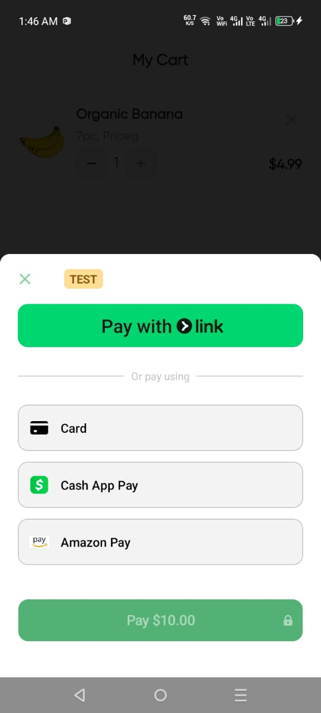
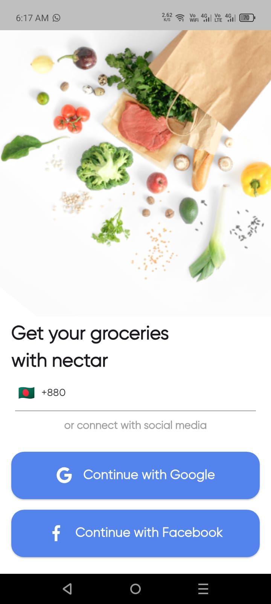
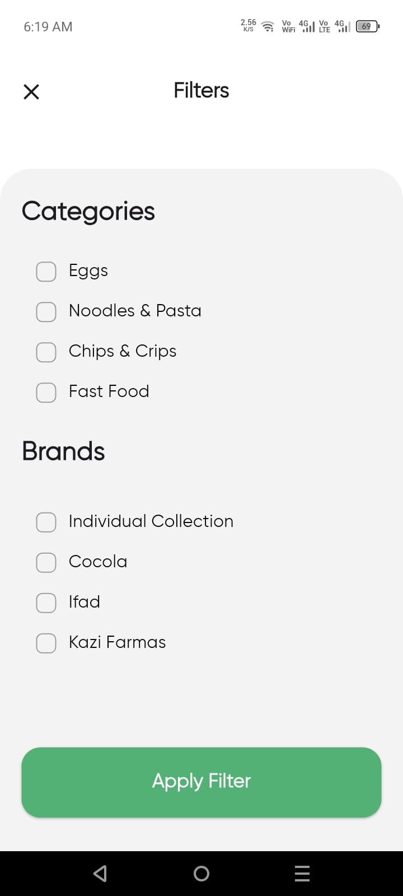
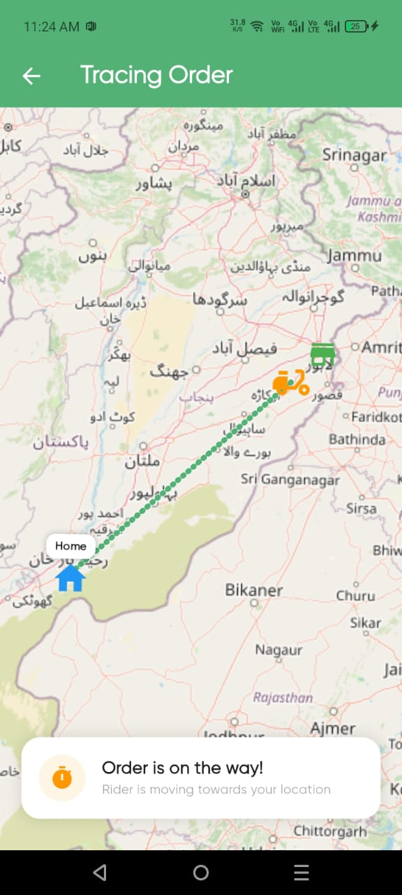

# 🛒 Nectar Grocery App - Full Stack Flutter & Firebase

Nectar is a premium grocery e-commerce application built with Flutter. It features a modern user interface, secure payment integration, and real-time order tracking.

---

## 📱 App Preview

|                       Welcome & Auth                        |                        Home & Filters                         |                         Checkout & Tracking                          |
|:-----------------------------------------------------------:|:-------------------------------------------------------------:|:--------------------------------------------------------------------:|
|      |     |   |
|   |   |         |

---

## ✨ Key Features
- **🎨 Modern UI/UX:** Responsive design optimized for all mobile screens using `flutter_screenutil`.
- **🔐 Social Authentication:** Secure login using Google, Facebook, and Email via Firebase Auth.
- **🔍 Advanced Filtering:** Complex category and brand-based product filtering logic.
- **💳 Stripe Payment:** Integrated secure payment gateway for seamless checkout experience.
- **📍 Real-Time Tracking:** Professional **Google Maps SDK** integration for live delivery tracing.
- **⚡ State Management:** Highly performant architecture using `GetX` for reactive updates.

---

## 📍 Advanced Mapping & Security Architecture
The application features a robust mapping system. While the codebase retains legacy support for OpenStreetMap (OSM), it is currently fully optimized for **Google Maps SDK**.

### 🔐 Security Implementation (Anti-Leak)
To protect sensitive data and billing accounts, I implemented a **Zero-Leak API Strategy**:
- **Local Properties Injection:** Google Maps API keys are never hardcoded in the `AndroidManifest.xml`.
- **Gradle Placeholders:** Keys are injected at build-time using `local.properties` and `manifestPlaceholders`.
- **Git Protection:** Sensitive configuration files are strictly managed via `.gitignore` to prevent public exposure.

### 🛠️ Mapping Features:
- **Live Rider Tracking:** Real-time marker updates using stream-based location data.
- **Dynamic Polyline Routing:** Visual path rendering from store to user destination.
- **Custom Markers:** Branded UI elements for riders and delivery points.

---

## 👨‍💼 Admin Panel Integration
This User App is powered by a dedicated **Admin Dashboard** for real-time management.
- **Functions:** Adding new inventory, managing product stock, and processing user orders.
  *Note: Admin Dashboard is a separate private repository. Contact for access.*

---

## 🛠️ Tech Stack

---

## 🚀 Portfolio & Hire Me
I am a specialized **Flutter & Python Developer** focused on building scalable automation tools and e-commerce solutions.

- **🌐 Live Portfolio:** [Visit Muhammad Rizwan's Portfolio](https://muhammadrizwan-dev.github.io/my_portfolio/)
- **🟢 Fiverr:** [Hire Me for Custom Projects](https://www.fiverr.com/s/Q7mrwgR)

---

## 👤 Developer Details
**Muhammad Rizwan**
*Computer Science Student & Flutter Developer*
📍 Rahim Yar Khan, Punjab, Pakistan

